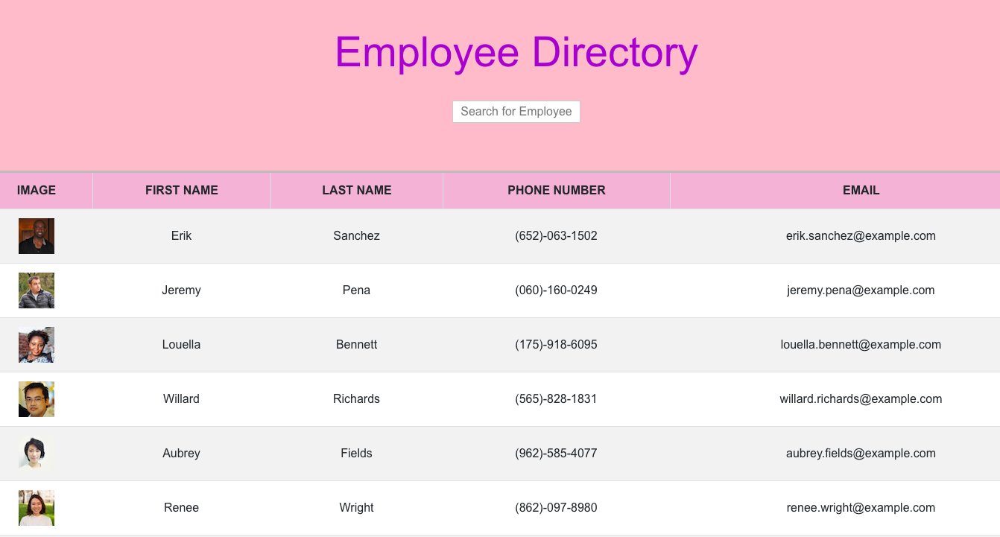

# Employee Directory
 

## INTRODUCTION

As a user, I want to be able to view my entire employee directory at once so that I have quick access to their information.
This an employee directory with React. The application's UI is broken into components, managed component state, and responds to user events.
 

## INSTALLATION

To run on local computers:

1. The user will need to install the following dependencies by running **npx create-react-app**

### PREVIEW

